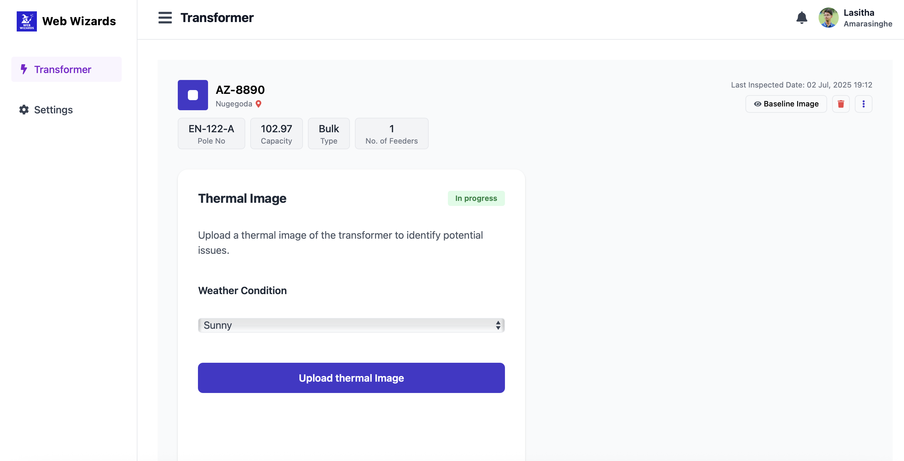

# **Transformer Thermal Inspection System – Phase 1**

---

### **Overview**
This project is a web-based system for managing transformers and their associated thermal imaging data. Phase 1 focuses on building the foundational components: an admin interface for managing transformer records, an image upload mechanism, and a system for categorizing baseline images by environmental conditions. The primary goal is to create a structured and easily searchable repository for transformer data.

Power utilities can use this system to digitize their thermal inspection workflow, providing a strong basis for future automated anomaly detection and maintenance planning.

---

### **Features Implemented (Phase 1)**

* **FR1.1: Admin Interface for Transformer Management**
    * Add new transformer records by entering details like region, transformer number, pole number, type, and location.
    * View all existing transformer records in a searchable and filterable table.
    * Edit and delete existing transformer records.
* **FR1.2: Thermal Image Upload and Tagging**
    * Upload thermal images directly to specific transformer entries.
    * Tag images as either **Baseline** (for future comparison) or **Maintenance** (for current inspection).
    * Images are stored with essential metadata, including the upload date/time, image type, and uploader.
* **FR1.3: Categorization by Environmental Conditions**
    * When uploading a baseline image, users must tag it with the observed environmental condition: **Sunny**, **Cloudy**, or **Rainy**.
    * This condition is selected using a dropdown menu during the upload process.
* **Additional Technical Features**
    * Images are stored and retrieved efficiently for quick viewing.
    * All transformer and image metadata are stored in a **PostgreSQL** database.
    * The admin interface is fully accessible via a web browser.
    * The modular architecture is designed to support easy extension in future development phases.

---

### **Setup Instructions**
This project consists of two separate components: a backend server (**Spring Boot**) and a frontend application (**React**).

#### **Prerequisites**
* Java (JDK 17+)
* Maven
* Node.js (v18+)
* npm or yarn package manager
* PostgreSQL (v14+)

#### **Backend Setup (Spring Boot)**
1.  Navigate to the `Backend` directory:
    ```sh
    cd Backend
    ```
2.  The backend is configured to connect to a PostgreSQL database. You may need to edit the `src/main/resources/application.properties` file to match your database credentials.
3.  Run the backend server:
    ```sh
    mvn spring-boot:run
    ```
4.  The backend REST API will start on `http://localhost:8080`.

#### **Frontend Setup (React)**
1.  Navigate to the `Frontend` directory:
    ```sh
    cd Frontend
    ```
2.  Install the required dependencies:
    ```sh
    npm install
    ```
3.  Start the frontend development server:
    ```sh
    npm start
    ```
4.  Open your web browser and go to `http://localhost:3000` to access the application.

---

### **User Instructions**
Based on the demo video, here's how to use the key features:

* **Managing Transformers:** On the main `Transformers` page, you can see a table of all existing transformers. To add a new one, click the **'Add Transformer'** button, fill in the details in the popup form, and click **'Confirm'**. A new row will appear in the table. You can also use the **'View'** button next to any transformer to see its associated inspections.


* **Viewing and Adding Inspections:** From the `Transformers` page, click the **'View'** button for a specific transformer to go to its dedicated inspection page. To add a new inspection, click **'Add Inspection'**, enter the details, and click **'Confirm'**.


* **Uploading Thermal Images:** On an individual inspection page, click **'View'** for a specific inspection. On the next page, you'll see options to upload images.
    * First, select the **weather condition** from the dropdown menu (Sunny, Cloudy, or Rainy).



*
    * Click the large **'Upload thermal image'** button to open your file explorer and upload a **maintenance image**.
    * Select the **baseline image** button and upload a **baseline image**.
    * Once both images are uploaded, the system will display a side-by-side comparison of the baseline and current maintenance images.

---

### **Test Data**
The repository includes seed data for initial testing, with a minimum of **5 transformer records**. Each of these records contains baseline images for all three environmental conditions: sunny, cloudy, and rainy.

---

### **Known Limitations / Issues**
* **Anomaly Detection:** Image comparison and automated anomaly detection features are not yet implemented. This functionality is planned for Phase 2.
* **User Authentication:** The system currently lacks user authentication. Any user can access and modify records. This will be addressed in future phases.
* **File Validation:** Upload file size validation is minimal.

---

### **Bonus / Additional Features**
* **Responsive UI:** The admin dashboard is designed to be responsive, providing a consistent experience across different devices.
* **Modular Code:** The codebase is structured with a modular architecture to ensure easy extension and maintenance in future phases.
* **Database Integration:** The PostgreSQL database is used effectively to store and manage all transformer metadata.

---

### **Demo**
A short video demo showcasing the implemented features for Phase 1 is included in the repository as `Phase1_Demo.mp4`.
