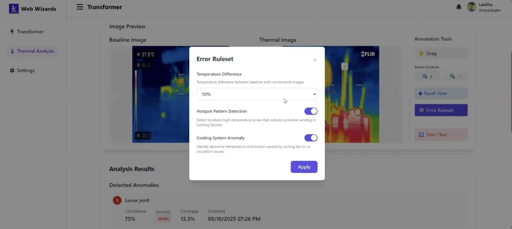

# Transformer Thermal Inspection System

---

## Overview
This project is a web-based system for managing transformers and their associated thermal imaging data.  

- **Phase 1** focused on building the foundational components: an admin interface for managing transformer records, an image upload mechanism, and a system for categorizing baseline images by environmental conditions.  
- **Phase 2** extends the system with **AI-based anomaly detection** capabilities, allowing automated comparison between baseline and maintenance images, highlighting potential issues, and presenting results in an interactive analysis page.  
- **Phase 3** added **interactive annotation tools**, allowing engineers to manually review, edit, and provide feedback for model improvement.  
- **Phase 4** enhances the system with **maintenance record generation and engineer input**, enabling full inspection documentation and historical tracking.

Power utilities can use this system to digitize their thermal inspection workflow, providing a strong basis for automated anomaly detection and predictive maintenance planning.

---

## Features Implemented

### Phase 1
* **FR1.1: Admin Interface for Transformer Management**
  * Add new transformer records by entering details like region, transformer number, pole number, type, and location.
  * View all existing transformer records in a searchable and filterable table.
  * Edit and delete existing transformer records.

* **FR1.2: Thermal Image Upload and Tagging**
  * Upload thermal images directly to specific transformer entries.
  * Tag images as either **Baseline** (for future comparison) or **Maintenance** (for current inspection).
  * Images are stored with essential metadata, including the upload date/time, image type, and uploader.

* **FR1.3: Categorization by Environmental Conditions**
  * When uploading a baseline image, users must tag it with the observed environmental condition: **Sunny**, **Cloudy**, or **Rainy**.
  * This condition is selected using a dropdown menu during the upload process.

---

### Phase 2
* **FR2.1: AI-Based Anomaly Detection Engine**
  * When both baseline and maintenance images are uploaded, the system automatically compares them.
  * Detects anomalies such as **hotspots**, **asymmetries**, or **temperature deviations**.
  * Uses a thresholding mechanism (default: 10% deviation) to flag anomalies.

* **FR2.2: Thermal Image Analysis Page**
  * After upload, users are redirected to the **Thermal Analysis Page**.
  * The baseline and maintenance images are displayed **side by side**.
  * Interactive controls include:
    - **Zoom In / Zoom Out**
    - **Drag (click & hold to move image)**
    - **Reset (return to default view)**
  * Anomalous regions are highlighted with **color-coded overlays** (bounding boxes, heatmaps, or markers).

* **FR2.3: Automatic Anomaly Marking**
  * Detected anomalies are annotated with metadata:
    - **Pixel coordinates**
    - **Anomaly size**
    - **Severity score**
    - **Confidence level**
    - **Detection date**
  * If no anomalies are found, results are displayed as: **Normal**.

* **FR2.4: Ruleset Configuration**
  * A new button **“Error Ruleset”** is available.
  * Clicking this opens a **popup window** where users can:
    - Set or adjust anomaly detection thresholds
    - Define error rules (e.g., deviation > 12% = severe anomaly)
   
* **FR2.5: Adding Notes**
  * Users can add custom notes under the analysis results.
  * Clicking **Confirm** saves the notes to the inspection record for future reference.

---

### Phase 3  

* **FR3.1: Interactive Annotation Tools**  
  * On the anomaly detection view, users can **interactively modify anomaly markers**.  
  * Supported interactions include:  
    - **Resize / Reposition** existing markers.  
    - **Delete** incorrectly detected anomalies.  
    - **Add new markers** by drawing **bounding boxes** or **polygonal regions**.  
  * Each annotation must include:  
    - **Annotation Type:** Added / Edited / Deleted  
    - **Comments or Notes:** Optional user remarks  
    - **Timestamp:** Date and time of action  
    - **User ID:** Identifier of the annotator  

* **FR3.2: Metadata and Annotation Persistence**  
  * All annotation interactions are **automatically saved** in the backend with the following metadata:  
    - **User ID**  
    - **Timestamp**  
    - **Image ID**  
    - **Transformer ID**  
    - **Action Taken**  
  * The **saved state** is instantly reflected in the **UI**.  
  * When revisiting the same image, **existing annotations are automatically reloaded** and displayed for continuity.  

* **FR3.3: Feedback Integration for Model Improvement**  
  * The system maintains a **feedback log** containing both:  
    - **Original AI-generated detections**  
    - **Final user-modified annotations**  
  * The feedback log is used for **model validation** and **retraining** to enhance accuracy.  
  * Users can **export the feedback log** in **JSON** or **CSV** format, including:  
    - **Image ID**  
    - **Model-Predicted Anomalies**  
    - **Final Accepted Annotations**  
    - **Annotator Metadata** (User ID, Timestamp, etc.)  
  * **User-modified annotations** directly contribute to improving the model’s detection performance over time.  

---

### Phase 4  

* **FR4.1: Generate Maintenance Record Form**  
  * For each transformer with a new maintenance image and completed analysis, automatically **generate a maintenance record form**.  
  * The record includes:  
    - Transformer metadata (ID, location, capacity)  
    - Inspection timestamp  
    - Embedded or thumbnail thermal image with anomaly markers (from Phase 3)  
    - List of detected/annotated anomalies with metadata (type, location, details)  

* **FR4.2: Editable Engineer Input Fields**  
  * Authorized users (e.g., maintenance engineers) can **add and edit details**, including:  
    - Inspector name  
    - Transformer status (**OK / Needs Maintenance / Urgent Attention**)  
    - Electrical readings (voltage, current, etc.)  
    - Recommended actions  
    - Additional remarks  
  * Supports text fields, dropdowns, and date pickers.  
  * Editable fields are **visually separated** from system-generated content.  

* **FR4.3: Save and Retrieve Completed Records**  
  * Completed records can be **saved to the database**, linked with the corresponding transformer and timestamp.  
  * Each record supports:  
    - Easy retrieval and filtering  
    - Export for reporting or documentation  
  * Includes a **record history viewer** showing all past maintenance forms per transformer.  

---

## Setup Instructions

This project consists of two separate components: a backend server (**Spring Boot**) and a frontend application (**React**).

### Prerequisites
* Java (JDK 17+)
* Maven
* Node.js (v18+)
* npm or yarn package manager
* PostgreSQL (v14+)

### Backend Setup (Spring Boot)
1. Navigate to the `Backend` directory:
    ```sh
    cd Backend
    ```
2. The backend is configured to connect to a PostgreSQL database.  
   Edit the `src/main/resources/application.properties` file to match your database credentials.
3. Run the backend server:
    ```sh
    mvn spring-boot:run
    ```
4. The backend REST API will start on `http://localhost:8080`.

### Frontend Setup (React)
1. Navigate to the `Frontend` directory:
    ```sh
    cd Frontend
    ```
2. Install the required dependencies:
    ```sh
    npm install
    ```
3. Start the frontend development server:
    ```sh
    npm start
    ```
4. Open your web browser and go to `http://localhost:3000` to access the application.

---

## User Instructions

### Phase 1
* **Managing Transformers:**  
  On the main `Transformers` page, you can see a table of all existing transformers.  
  To add a new one, click the **'Add Transformer'** button, fill in the details, and click **'Confirm'**.  
  You can also use the **'View'** button next to any transformer to see its associated inspections.

  

* **Viewing and Adding Inspections:**  
  From the `Transformers` page, click the **'View'** button for a specific transformer to go to its inspection page.  
  To add a new inspection, click **'Add Inspection'**, enter the details, and click **'Confirm'**.

  
  

* **Uploading Thermal Images:**  
  On an inspection page:
  * Select the **weather condition** from the dropdown menu (Sunny, Cloudy, or Rainy).  
  * Click **'Upload thermal image'** for maintenance images.  
  * Use the **'Baseline image'** button for baseline uploads.  
  * Once both are uploaded, the system displays them for comparison.

---

### Phase 2
* Upload both **baseline** and **maintenance** images.  


* The system redirects to the **Thermal Analysis Page**.  

* Review detected anomalies (or "Normal" if none found).  

* Use **zoom, drag, reset** for image navigation.  
* Open **Error Ruleset** to configure thresholds.  

* Review analysis results with metadata.  
* Add **notes** and save with **Confirm**.  


### Phase 3

* View and analyze anomaly annotations.

* Remove unwanted anomaly annotations.

* Modify and fine-tune anomaly annotations.

* Create new anomaly annotations.

* Review and export annotation logs to enhance model feedback.

### Phase 4

* Phase 4 allows the engineer to create a final, formal digital record of the inspection and view past records.
* Generate Digital Form: After completing the image upload and analysis steps (Phase 1-3), navigate to the inspection overview. Click the "Digital Form" button to generate the maintenance record.

* Fill and Save Maintenance Records: The generated form includes system-generated data and editable fields for the engineer.
* The record is divided into sections, such as General Record, Maintenance Record, and Work - Data Sheet.
* Fill in required fields like Inspector Name, Transformer Status (OK/Needs Maintenance/Urgent Attention), Electrical Readings, and Recommended Action.
* General Record Form:


* Maintenance Record Form:


* Work Data Sheet:


* View and Export Past Records: Use the Past Forms interface to view a history of all completed maintenance records for the transformer. You can download a completed form using the Download button.


---

## Known Limitations / Issues
* **Phase 1:**  
  - User authentication not implemented (anyone can access/modify records).  
  - File validation (size/type) is minimal.  

* **Phase 2:**  
  - Detection accuracy depends on model training data.  
  - Current ruleset supports only predefined thresholds.  
  - Inference time may vary for larger image sets.  

* **Phase 3:**   
  - Concurrent edits by multiple users may cause synchronization conflicts.  
  - Annotation changes are stored instantly but may experience slight UI refresh delays.    

* **Phase 4:** 
  - Role-based access control not fully enforced for form editing.
  - Export and report formatting still under development.
  - Record history filtering may slow down with very large datasets.

---

## API Endpoints Used

The frontend calls several backend endpoints. Below is a concise table of the key endpoints used by the React app and a short description of what each does.

| Endpoint | Method | Purpose |
|---|---:|---|
| /api/transformers | GET | Fetch list of transformers. |
| /api/transformers | POST | Create a new transformer record. |
| /api/inspections | GET | Fetch list of inspections. |
| /api/inspections | POST | Create a new inspection record. |
| /api/images | POST | Upload an image (baseline or maintenance) — expects multipart/form-data with `file` and `inspectionId`. Returns image metadata. |
| /api/images/{id} | GET | Download a specific image blob by id (used to display images). |
| /api/ml/predict | POST | ML prediction endpoint (JSON body). |
| /api/ml/predict-image/{imageId} | POST | ML prediction for a stored image by ID. |
| /api/ml/predict-upload | POST | ML prediction from an uploaded image (multipart form). |
| /api/thermal/analyze | POST | Analyze two images (JSON body with paths). |
| /api/thermal/analyze-images/{baselineId}/{candidateId} | POST | Analyze images already stored on the server by their IDs. |
| /api/thermal/analyze-upload | POST | Analyze two uploaded images (multipart form fields `baselineFile` and `candidateFile`). |
| /api/thermal/analyze-with-baseline/{candidateId} | POST | Analyze a stored candidate image using an uploaded baseline file (multipart with `baselineFile`). |
| /api/anomalies/insert | POST | Insert anomaly records (array of anomalies in JSON body). |
| /api/anomalies/delete | DELETE | Hard delete anomaly by inspection number and index. |
| /api/anomalies/delete | PATCH | Soft delete anomaly by inspection number and index. |
| /api/anomalies/{inspectionNumber} | GET | Get all anomalies for a given inspection number. |
| /api/analysis-results | POST | Save analysis result boxes for an inspection. |
| /api/records | POST | Save a completed maintenance record form. |
| /api/records/{transformerId} | GET | Retrieve all historical records for a specific transformer. |
| /api/records/export/{recordId} | GET | Export a specific maintenance record (e.g., as PDF or JSON). |


Notes:
- All endpoints are prefixed with `http://localhost:8080` in development (see `Frontend/src/API.js`).
- The thermal analysis endpoints return a JSON object containing analysis metadata. Typical fields include:
  - `boxes`, `boxInfo`, `faultType`, `confidence`, `processingTimeMs`
  - Additional fields: `prob`, `histDistance`, `dv95`, `warmFraction`, `imageWidth`, `imageHeight`, `annotated`, `prediction`, `metadata`
  - On error, responses include `success: false` and an `errorMessage` field.


